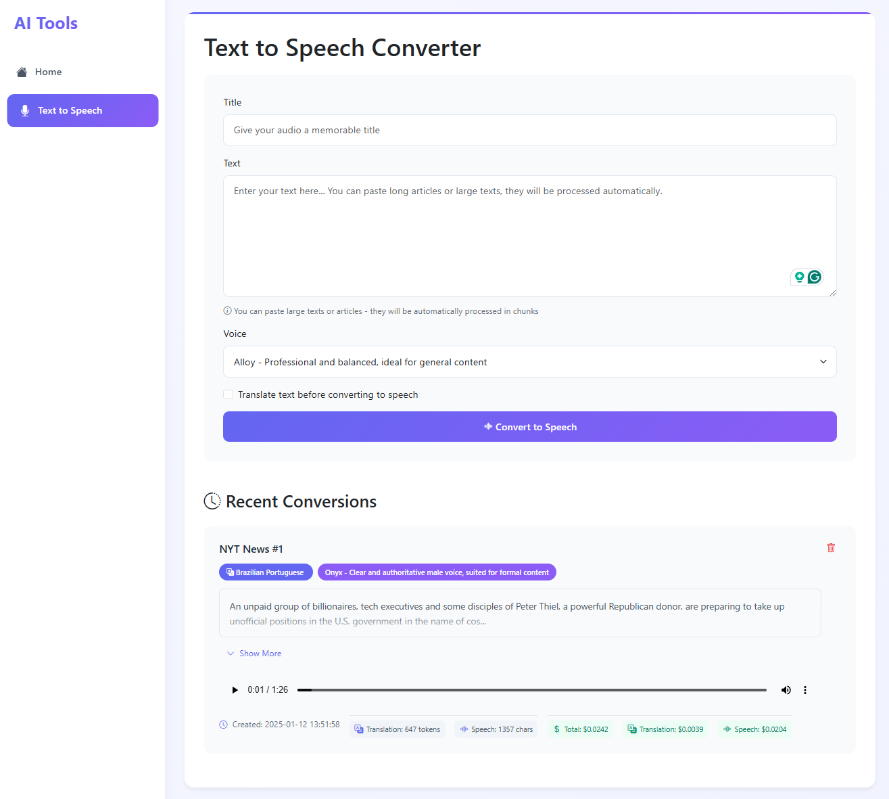
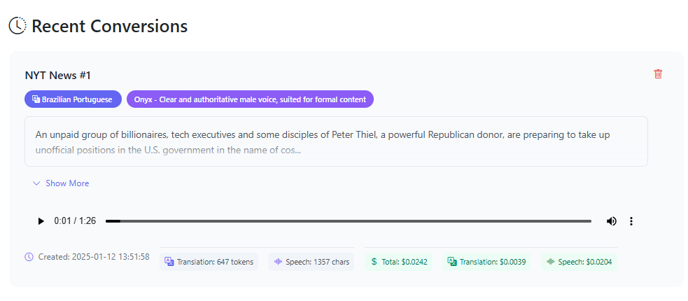

# AI Tools Hub

> The intention is for creating a hub for you to be able to use it just adding your Open API key, without wrappers. \
> It is not intended to be a published app, it is intended to be a local tool.


A tool that provides various AI-powered tools for content processing and generation. Currently featuring Text-to-Speech conversion with translation capabilities, with plans to expand to more AI tools in the future.


## Current Features

### Text to Speech Converter
- Convert text to natural-sounding speech using OpenAI's TTS API
- Support for multiple voices with different characteristics
- Built-in translation to multiple languages before speech conversion
- Real-time cost estimation and token usage tracking
- Beautiful, modern UI with responsive design
- History of conversions with playback capability
- Support for long texts with automatic chunking

## The tool





## Getting Started

### Prerequisites
- Python 3.8 or higher
- OpenAI API key
- Virtual environment (recommended)

### Installation

1. Clone the repository
```bash
git clone https://github.com/wilsonneto-dev/ai-tools-hub.git
cd ai-tools-hub
cd src
```

2. Create and activate a virtual environment
```bash
# Windows
python -m venv .venv
.\.venv\Scripts\activate

# Linux/Mac
python -m venv .venv
source .venv/bin/activate
```

3. Install dependencies
```bash
pip install -r requirements.txt
```

4. Set up environment variables
```bash
# Windows
set OPENAI_API_KEY=your_api_key_here

# Linux/Mac
export OPENAI_API_KEY=your_api_key_here
```

### Running the Application

1. Start the Flask development server
```bash
python ./app.py
```

2. Open your browser and navigate to `http://localhost:5000`

## Cost Information

The application uses OpenAI's APIs with the following pricing:
- Text-to-Speech: $15.00 per 1 million characters
- Translation (GPT-3.5 Turbo): $6.00 per 1 million tokens

Costs are calculated and displayed in real-time for each conversion.

## Project Structure
```
ai-tools-hub/
├── app.py                 # Main Flask application
├── lib/                   # Core functionality
│   ├── text_to_speech.py # Text-to-speech conversion logic
│   └── translations.py   # Translation handling
├── static/               # Static files (CSS, JS, audio files)
│   └── audio/           # Generated audio files
└── templates/            # HTML templates
    ├── base.html        # Base template
    ├── home.html        # Homepage
    └── text-to-speech.html # Text-to-speech interface
```

## Roadmap

### Containerization
- [ ] Create Docker image for easy deployment
    - The use should be simplified to just running a docker container with the API key in env vars.

### New Text-to-Speech Features
- [ ] Support for file uploads (PDF, DOCX, TXT)
- [ ] URL processing for article conversion

### Additional AI Tools
- [ ] Image generation tool
- [ ] Text summarization


## Contributing

Contributions are welcome! Please feel free to submit a Pull Request.

## License

This project is licensed under the MIT License - see the LICENSE file for details.

## Acknowledgments

- OpenAI for their powerful APIs
- Flask framework
- Bootstrap for the UI components
- All contributors and users of this project

## Support

If you encounter any issues or have questions, please file an issue on the GitHub repository. 